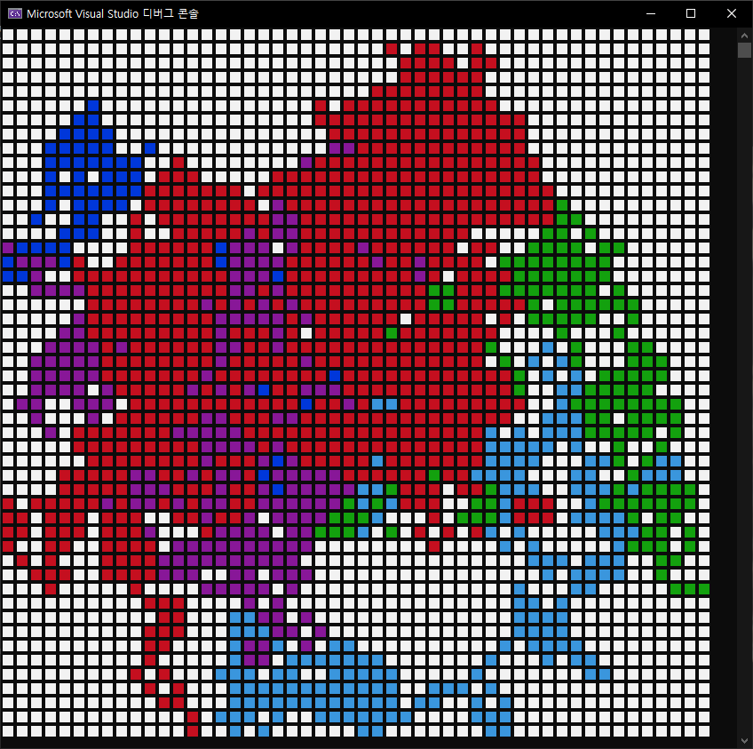

# 랜덤 걷기

랜덤 걷기는 가장 단순한 랜덤 시뮬레이션 알고리즘 입니다.  
이 시뮬레이션에서 걷기를 수행하는 __워커(Walker)__ 는 자신의 위치를 기준으로 정해진 시간에 따라 난수를 발생시켜 이동합니다.  
워커는 상하좌우인 4방향 또는 대각선을 포함한 8방향을 이동하게 되는데 원점을 포함하는 경우도 있고 아닌 경우도 있습니다.  
  
> 랜덤 걷기 시뮬레이션은 매우 단순한 알고리즘이지만 기체 내 분자의 움직임처럼 현실 세계에서 일어나는 현상을 모델링 하는데 이용할 수 있습니다.  

제가 만든 이 랜덤 걷기 시뮬레이션은 하나의 __판(Board)__ 위에서 여러 명의 워커가 벽에 부딪힐 때까지 8방향으로 이동하는 모습을 관측할 수 있습니다.  
모든 워커가 벽에 부딪혀 시뮬레이션이 종료하게 되면 워커의 정보를 저장해 텍스트 파일로 확인할 수 있도록 했습니다.  
  
 텍스트 파일에는 워커의 ID, 걸음 횟수, 마지막 위치를 저장했습니다.
- [워커의 정보](walker_info.txt)

콘솔 프로그램으로 제작했기 때문에 각 워커의 움직임을 눈으로 확인할 수 있도록 색상을 부여했습니다.  
다만 이 경우에 워커가 어떤 경로로 이동했는지에 대해서는 대략적으로 유추할 수 있지만 자세한 이동 경로는 파악하기 어렵습니다.  
만약 정확한 경로를 알고 싶다면 워커의 멤버 변수에 위치를 기록하는 배열을 생성해서 알아볼 수 있을 것입니다.  

